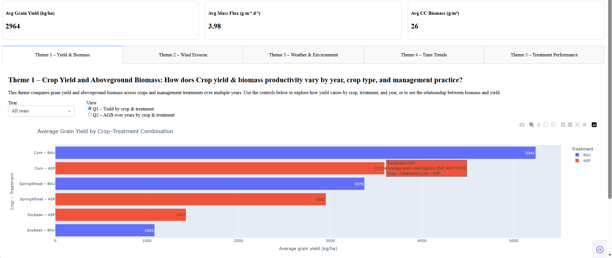
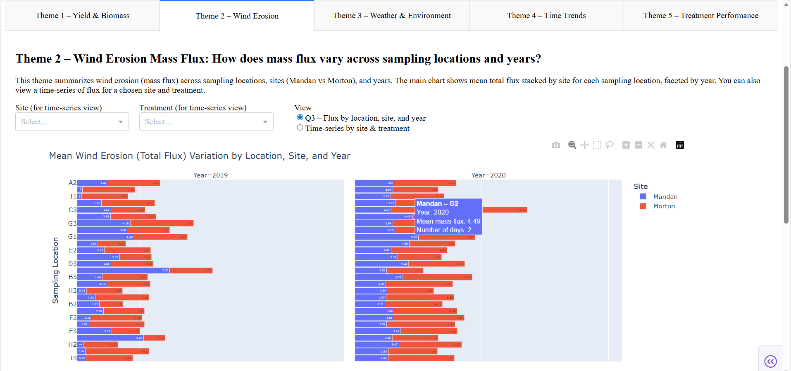
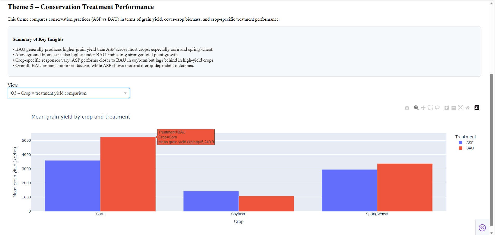

# Dash-and-Plotly-Visualization-Dashboard.

Interactive dashboards built with **Dash + Plotly** to analyze **agricultural and environmental datasets**.
This project explores crop yield, cover crop biomass (AGB), wind erosion (mass flux), and weather conditions
across multiple years and locations.

---

## Project Overview
This dashboard was developed as part of an **Advanced Data Visualization** project.
It provides an interactive way to explore relationships between:

- **Crop yield trends**
- **Aboveground biomass (AGB)**
- **Wind erosion (Mass Flux / Total Flux)**
- **Daily weather variables** (wind speed, temperature, precipitation, etc.)
- **Treatment comparisons across sites and years**

The application is organized into multiple themes/tabs for easier interpretation.

---

## Files in this Repository

### Main Application
- `app.py` → Dash web application (run this file to launch the dashboard)

### Notebooks (analysis + development)
- `Theme1.ipynb`
- `Theme2.ipynb`
- `Theme3.ipynb`
- `Theme4.ipynb`
- `Theme5.ipynb`
- `Plotly_Charts.ipynb`

### Datasets
- `h5_i2_2019-2022_hand_harvest.csv` → yield and harvest measurements
- `h5-i2_2016-2021_daily-weather.csv` → daily weather dataset
- `I2_CC_AGB_2020-2022.csv` → cover crop biomass (AGB) dataset
- `Mass Flux values 2019_2022 updated.csv` → wind erosion / mass flux dataset
- `avg wind speed nwern.xlsx` → wind speed tower averages

### HTML Outputs
- `fig_4_1a_Annual_Yield_Trends.html`
- `fig_4_1b_Monthly_Erosion_Trends.html`
- `fig_4_1c_Annual_AGB_Trends.html`

---

## Dashboard Preview

### Theme 1 – Yield & Biomass


### Theme 2 – Wind Erosion


### Theme 5 – Treatment Performance



---

## How to Run the Dashboard Locally

### 1) Install Python packages
Open your terminal (or Anaconda Prompt) and run:

```bash
pip install dash plotly pandas numpy openpyxl
```

### 2) Run the app
Make sure you're in the same folder as app.py, then run:
python app.py

### 3) Open in browser
After running, open the link shown in your terminal (usually):
[Open the dashboard](http://127.0.0.1:8050/)

## Tools & Technologies Used
Python
Dash
Plotly
Pandas
NumPy


---

## 👩🏽‍💻 Author
**Rosalyn Ezeako**  
